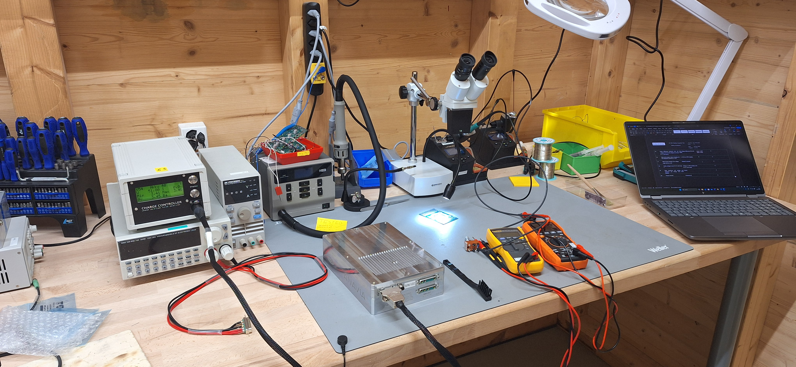

# Workshop

Brief Repo that keeps my Workshop setup and documents improvements.

In here I will filter all the information and porgres workshop related for my eltectonics background. Fell free to check it to find what can be useful along this discipline, and what kind of information you sould get on the quick dial for an easy start doing test benches, repairs and prototyping; or even more concrete tasks.

